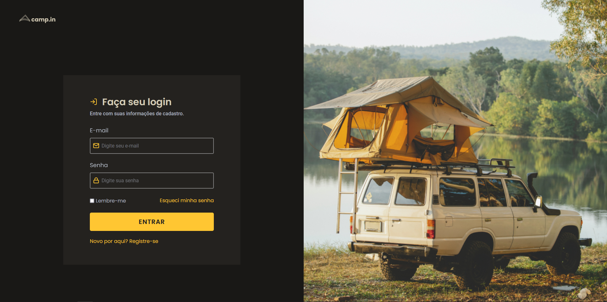
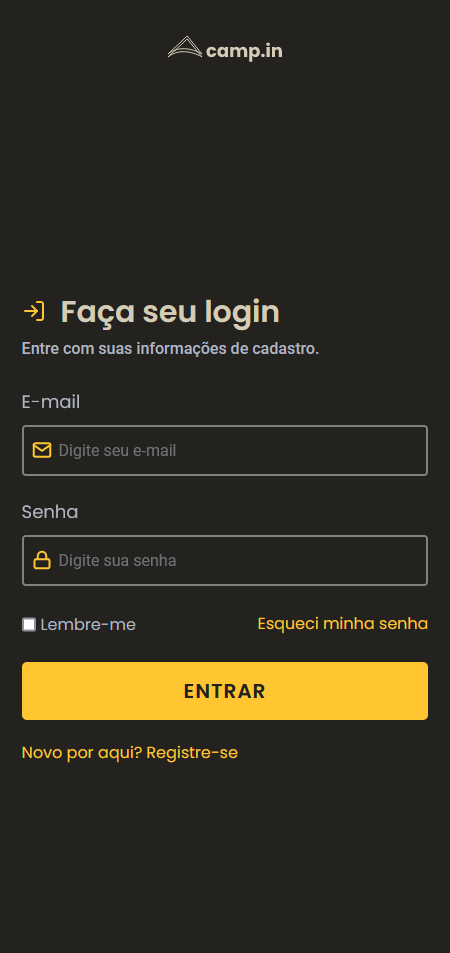

# Camp.io Login Screen

<div align="center">
  <h1 align="center">💻Desktop Version</h1>
  
  
  <h1>📱Mobile Version</h1>
       
</div>

---
                                                                                                                                                                                                                            

## 💻 About The Project
Login screen made for a camping site

Original Concept by Rocketseat💜

<br>

## 🛠 Tecnologies 
✔️HTML

✔️CSS

✔️JAVASCRIPT
    
<br>

## 🚀 How To Test ?
Live Website -> https://camp.io-loginscreen.netlify.app

or

You can clone the project using this command:

```
git clone https://github.com/lucassoares01/camp.io-loginscreen.git
```
